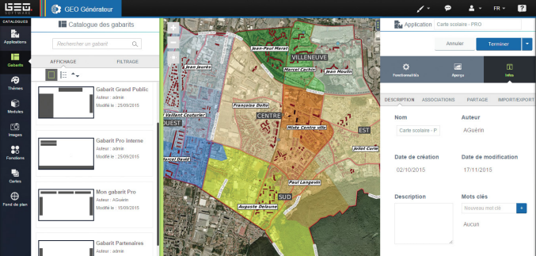

# GEO Générateur
Le GEO Générateur de Business Geografic permet de générer rapidement des propres cartes et applications cartographiques HTML5 personnalisées, pour tous publics, sur tous supports, à partir de toutes données géographiques et métier.
Il propose à ses utilisateurs une avance technologique permanente et parfaitement conforme aux recommandations CNIG, OGC et INSPIRE pour la gestion des données et métadonnées.

Les données, fonctionnalités, cartes et applications sont des ressources GEO, centralisées au sein d'un catalogue de ressources GEO. Elles sont utilisables dans toutes les applications GEO ainsi que celles des collaborateurs et partenaires avec qui elles sont partagés.

## Référencez vos données

<b>Connectez-vous</b> directement et simultanément à toutes vos sources de données et métadonnées : bases spatiales, bases métier, web services. Utilisez les intégrateurs et connecteurs métier GEO pour accéder aux données et métadonnées stockées dans vos outils métier. Le GEO Générateur lit nativement tous les standards SIG et formats de données normalisés, en créant des liens dynamiques avec vos données.  

<b>Référencez vos données</b> dans votre Catalogue de Ressources GEO. Scannez vos données, pré-renseignez les champs de vos métadonnées, cataloguez vos données et moissonnez vos métadonnées. Vous pouvez pour cela vous appuyer sur GEO Metadata. GEO respecte, par sa philosophie-même, les recommandations CNIG, INSPIRE et OGC pour la gestion et le partage des données et métadonnées avec vos collaborateurs et partenaires.  

<b>Préparez, classez et organisez</b> vos couches, fonds de plans et thématiques. Créez des champs virtuels. Vous pouvez également créer, gérer, importer et exporter vos couches et thématiques personnelles.

## Créez vos fonctionnalités

<b>Paramétrez sans coder</b> les fonctionnalités que vous souhaitez intégrer dans vos cartes et applications GEO, en exploitant toute la puissance fonctionnelle de GEO. Vos fonctionnalités s’enregistrent dans votre Catalogue de Ressources GEO.  Elles sont transverses à tous vos projets cartographiques. Vous pouvez les partager avec vos collègues et partenaires dans une démarche de mutualisation et de collaboration.
- <b>Recherches et analyses</b> : Définissez vos recherches multi-critères sur toutes vos données spatiales et attributaires. Créez vos analyses simples, par classes et multivaluées ; l’intuitivité offerte par les interfaces utilisateurs GEO offre une approche remarquablement simple pour ventiler, agréger et croiser toutes vos données.
- <b>Fiches d’information</b> : Préparez vos fiches d’information multimédia à partir des modèles GEO ou en créant les vôtres. Utilisez les sections, onglets et pavés déroulants pour structurer efficacement l’information. Vous pouvez lier des fiches d’information entre elles et les enrichir avec tous type de contenus : lien web, flux de données multimédia, etc. 
- <b>Statistiques, tableaux de bord et rapports</b> : Exploitez la puissance de calcul et les nombreux modes de représentation tabulaires, statistiques et cartographiques avancés de GEO. Construisez vos rapports et tableaux de bord par simple cliquer-déposer, pour tous vos besoins de suivi, d’analyse et d’aide à la décision ; paramétrez vos propres modèles d’export selon les mêmes principes ergonomiques.

## Préparez vos cartes

<b>Projetez vos données</b> en cliquant-déposant vos tables, géotables et rasters sur vos fonds de plans.

<b>Paramétrez</b> l’emprise de vos cartes, l’opacité et les seuils de visibilité de vos fonds de plans et couches thématiques.

<b>Editez</b> le style de vos étiquettes et info-bulles ; préparez vos légendes de cartes ; renseignez les métadonnées de vos cartes.

<i>Vos cartes s’enregistrent dans votre catalogue de ressources GEO. Vous pouvez en faire des ressources GEO partagées pour vos collaborateurs et partenaires et les publier sous forme de web services.</i>

## Générez vos applications SIG

<b>Générez et démultipliez</b> en un temps record vos applications cartographiques HTML5 responsive pour tous vos publics, sur tous les supports et à partir de toutes vos ressources GEO : données, fonctionnalités, cartes. GEO favorise la réutilisation et la mutualisation des ressources en permettant, à partir des mêmes ressources GEO, de décliner autant d’applications cartographiques web et mobiles que de besoins professionnels et grand public. 

<b>Choisissez un gabarit de diffusion</b> à usage professionnel ou grand public ainsi qu’un thème graphique ; personnalisez-les en fonction de votre identité visuelle et de vos utilisateurs-cibles.

<b>Générez votre application</b> en cliquant-déposant une carte GEO et en l’enrichissant avec les fonctionnalités et modules fonctionnels GEO de votre choix. Votre application se génère sous vos yeux en mode HTML5 responsive natif ; elle s’adapte automatiquement aux écrans des tablettes et smartphones pour vous affranchir des développements mobiles spécifiques. 

<b>Publiez vos applications cartographiques</b> en un clic, via des liens web personnalisables ou au sein de vos supports web existants (portails Extranet, outils Intranet, sites Internet, etc.). Vous pouvez également les diffuser sous forme d’applications mobiles dédiées et les référencer dans les « mobile app stores ». Vous pouvez en outre les partager sous forme de web services ou utiliser les API GEO pour les exploiter directement dans vos progiciels métier. 

Vos applications cartographiques GEO sont générées une seule fois pour tous les supports : ordinateurs, tablettes, smartphones.

Elles sont facilement démultipliables et personnalisables en fonction de vos publics, de leurs besoins et attentes spécifiques :
- <b>applications professionnelles</b> : intégrez vos cartes GEO dans les gabarits de diffusion à usages professionnels ; vos collaborateurs et partenaires pourront ainsi exploiter l’ensemble des fonctionnalités et outils métier GEO, en modes web et/ou mobile, connecté et/ou déconnecté. 
- <b>applications grand public</b> : intégrez vos cartes GEO dans les gabarits de diffusion à usage grand public et/ou déclinez vos applications grand public à partir de vos applications métier GEO existantes ; vos cibles grand public apprécieront la modernité et la richesse de vos applications, qu’ils les utilisent en modes web et/ou mobile, connecté et/ou déconnecté. 

A l’instar des données, fonctionnalités et cartes GEO, vous pouvez partager vos applications cartographiques GEO avec vos collègues, homologues et partenaires, pour mutualiser vos ressources et développer l’entraide. GEO assure une gestion fine des droits de vos utilisateurs et groupes d’utilisateurs sur vos ressources GEO partagées.
